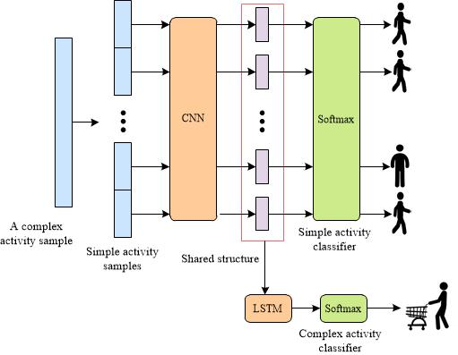
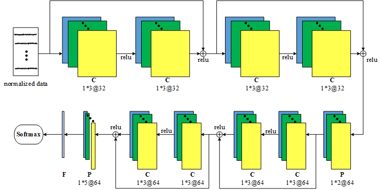

## AROMA: A Deep Multi-Task Learning Based Simple and Complex Human Activity Recognition Method Using Wearable Sensors


This is the implementation of our paper "A Deep Multi-Task Learning Based Simple and Complex Human Activity Recognition Method Using Wearable Sensors". This work has been accepted by Ubicomp 2018.
<br>

=======
## Introduction
In activity recognition, simple and complex activity recognition are a pair of related tasks. Simple acitvities are usually characterized by repeated and low-level actions, e.g., runing, sitting, and walking. Compared to simple activities, complex activities are more complicated and high-level  activities like working, having dinner, commuting. And a complex activity may include several low-level simple activities. For instance, having dinner, a kind of complex activity, can include standing and walking to select food and sitting at the table to eat, the simple activities. In other words, simple activities can be regarded as the components of complex activity. In our model called AROMA, we use multi-task learning to recognize simple and complex activities simultaneously by using a shared representation to improve generalization and accuracy of the model.(Our paper "AROMA: A deep multi-task learning based simple and complex activity recognition method using wearable sensors" under review)
>>>>>>> 6cad9d08ec7936b0a66fbe7edc84f47bc64d8e7d

## The structure of the project
<li> Requirements: TensorFlow 1.2.1, Python 2.7
<li> config.py:  containing parameters the model will use, like window length of simple activity and complex activity, training parameters e.g., batch size, learning rate decay speed. The dataset path has to be appointed in "self.dataset" in config.
<li> utils.py: containing commonly used functions in the project
<li>joint_model.py: building and training the model
<li> main.py: entrance of the project

We preprocess the dataset by removing the unlabeled data and prune it into the proper window size, which can be downloaded at huynh.cp. 
You can run main.py -h to get the args:

```
python main.py -h
```

Three args would be listed:

```
optional arguments:
  -h, --help         show this help message and exit
  --test TEST        select the test day. Max num is 6
  --version VERSION  model version
  --gpu GPU          assign task to selected gpu
```

For leave-one-out cross-validation, the "test" option should be assigned to test one day data in the dataset. Therefore, for example, you can run:

```
python main.py --test 0 --version har-model --gpu 0
```


